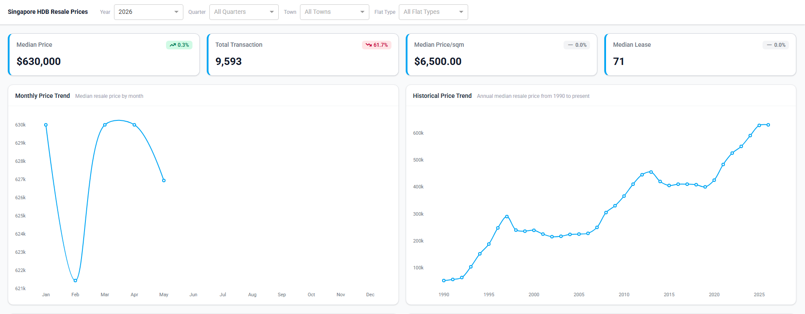
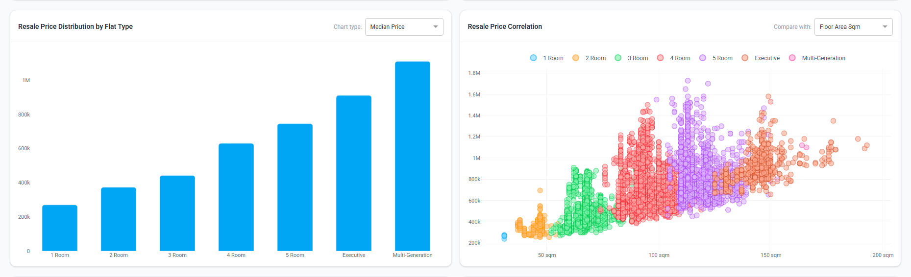
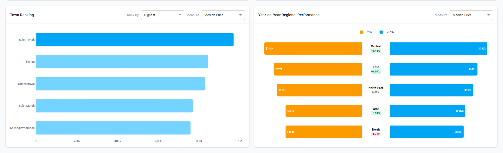
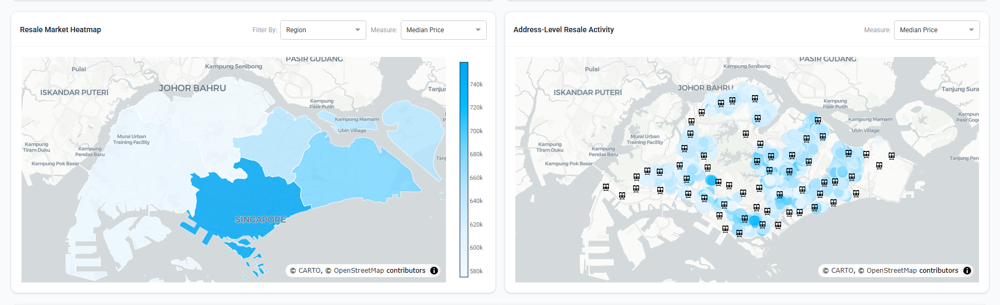
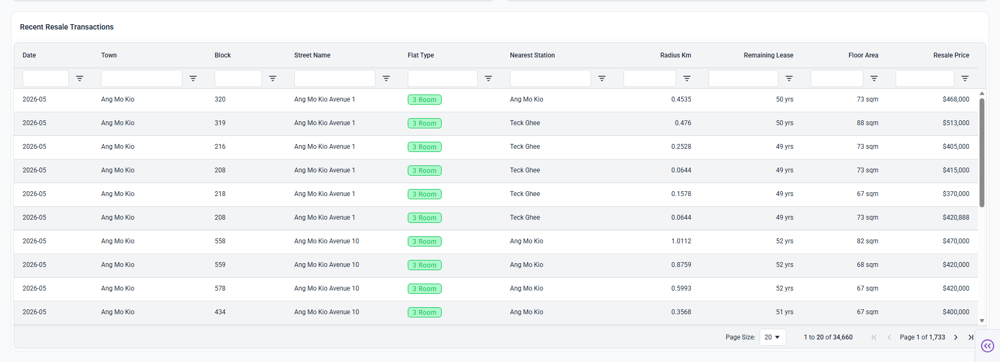

# HDB Resale Price Dashboard

An interactive analytics dashboard for exploring Singapore HDB resale flat transactions. Fetches data from public APIs, geocodes addresses, enriches records with nearby MRT stations, and presents the results through a browser-based dashboard with maps, charts, and filterable tables.

---

## Table of Contents

- [Overview](#overview)
- [Preview](#preview)
- [Prerequisites](#prerequisites)
- [Installation](#installation)
- [Environment Variables](#environment-variables)
- [Running the App](#running-the-app)
  - [Data Loading Modes](#data-loading-modes)
  - [Option 1 — Run Locally](#option-1--run-locally-development)
  - [Option 2 — Run Locally with Docker](#option-2--run-locally-with-docker)
  - [Option 3 — Deploy to Google Cloud Run](#option-3--deploy-to-google-cloud-run)
- [Google Cloud Run — One-Time GCP Setup](#google-cloud-run--one-time-gcp-setup)
- [CI/CD with GitHub Actions](#cicd-with-github-actions)
- [Data Ingestion (Optional)](#data-ingestion-optional)
- [Project Structure](#project-structure)
- [Tech Stack](#tech-stack)
- [Dashboard Views](#dashboard-views)
- [Notebooks](#notebooks)
- [Known Limitations](#known-limitations)

---

## Overview

- Fetches resale transaction records from [data.gov.sg](https://data.gov.sg)
- Geocodes flat addresses via the Google Maps Geocoding API
- Enriches records with nearby MRT stations via the Google Maps Places API
- Cleans and transforms raw data into analysis-ready datasets
- Reads processed data from Google Cloud Storage in cloud-hosted deployments
- Serves an interactive Dash dashboard with views for trends, distributions, rankings, correlations, comparisons, choropleth maps, and scatter maps
- Ships as a Docker container served by [Gunicorn](https://gunicorn.org/), deployable to Google Cloud Run
- Provides a GitHub Actions workflow for automated CI/CD to Cloud Run across `main` and `dev` branches

> **Pre-fetched data is included under `data/`.** You can skip ingestion entirely and go straight to running the dashboard unless you need fresh data.

> Clean data is also available on [HuggingFace](https://huggingface.co/datasets/jasonengs/singapore_hdb_resale_prices).

---

## Preview

<!--  -->






---

## Prerequisites

### Local Development

| Requirement | Version |
|---|---|
| [Python](https://www.python.org/) | >=3.11 |
| [uv](https://docs.astral.sh/uv/) | Latest |
| [Node.js](https://nodejs.org/en) + [npm](https://www.npmjs.com/) | For TailwindCSS CLI |

### Docker & Cloud Deployment

| Requirement | Purpose |
|---|---|
| [Docker](https://docs.docker.com/get-docker/) | Build and run container images locally or for deployment |
| [Google Cloud CLI (`gcloud`)](https://cloud.google.com/sdk/docs/install) | Interact with GCP services |
| Google Cloud account | Cloud Run, Artifact Registry, and GCS |

### Optional — Only Needed to Refresh Data

| Service | Used for | Cost |
|---|---|---|
| [data.gov.sg API](https://data.gov.sg/developer) | HDB resale, price index, geo, and MRT records | Free |
| [Google Maps Geocoding API](https://developers.google.com/maps/documentation/geocoding) | Geocoding flat addresses | Free up to 10,000 requests/month |
| [Google Maps Places API](https://developers.google.com/maps/documentation/places) | MRT station lookup | **Paid** — charges apply per request |

---

## Installation

### 1. Clone the repo

```bash
git clone https://github.com/jasonengs/singapore-hdb-resale-prices.git
cd hdb-resale
```

### 2. Install Python dependencies

```bash
uv sync
uv run pip install -e .
```

### 3. Install Node dependencies (TailwindCSS)

```bash
npm install
```

---

## Environment Variables

Create a `.env` file in the project root. API keys are only required if you intend to re-ingest data.

```env
# Required only for data ingestion / refresh
DATA_GOV_API_KEY="YOUR_DATA_GOV_SG_API_KEY"
GOOGLE_MAPS_API_KEY="YOUR_GOOGLE_MAPS_API_KEY"
```

---

## Running the App

There are three ways to run the dashboard depending on your needs.

### Data Loading Modes

All loader functions in `src/dashboard/datasets/loader.py` follow a `_local` / `_cloud` naming convention. The correct set must be active in `src/dashboard/callbacks/` **before running or building the app**.

| Suffix | Data Source | Use With |
|---|---|---|
| `_local` | `data/` directory on disk | Options 1 and 2 |
| `_cloud` | Google Cloud Storage bucket | Option 3 |

To switch modes, update the imports in the relevant files under `src/dashboard/callbacks/` — swap the suffix on every loader to match your target environment:

To switch modes, update the imports in the relevant files under `src/dashboard/callbacks/`:

```python
# Local development — Options 1 and 2
from dashboard.datasets.loader import load_data_local
from dashboard.datasets.loader import load_address_local
# ... same pattern for any other loaders

# Google Cloud Run — Option 3
from dashboard.datasets.loader import load_data_cloud
from dashboard.datasets.loader import load_address_cloud
# ... same pattern for any other loaders
```

### Option 1 — Run Locally (Development)

This is the fastest way to get started and is recommended for active development.

#### Step 1 — Build TailwindCSS

The dashboard requires a compiled `styles.css`. Run the watcher during development to automatically recompile on file changes.

```bash
npm run dev
```

Reads from `src/dashboard/assets/input.css` → writes to `src/dashboard/assets/styles.css`.

> See the [TailwindCSS CLI docs](https://tailwindcss.com/docs/installation/tailwind-cli) for further reference.

#### Step 2. Start the app

```bash
uv run python src/main.py
```

Open `http://localhost:8050` in your browser.

---

### Option 2 — Run Locally with Docker

Use this option to validate the containerized build before deploying to Cloud Run, or to run the app without installing Python and Node locally.

#### Step 1 — Build the image

```bash
docker build -t hdb-dashboard .
```

#### Step 2 — Run the container

```bash
docker run --hdb-dashboard -p 8080:8080 \
```

Open `http://localhost:8080` in your browser.

---

### Option 3 — Deploy to Google Cloud Run
This is the production deployment path. The app is built as a Docker image, pushed to Artifact Registry, and served by Cloud Run.

Before deploying, complete the **one-time GCP setup** in the section below. Once set up, deployments are handled automatically by GitHub Actions on every push.

#### Manual deployment (without GitHub Actions)

```bash
# Authenticate Docker with Artifact Registry
gcloud auth configure-docker YOUR-REGION-docker.pkg.dev

# Build and push the image
docker build -t YOUR-REGION-docker.pkg.dev/YOUR-PROJECT-ID/YOUR-SERVICE-NAME/IMAGE-NAME:latest .
docker push YOUR-REGION-docker.pkg.dev/YOUR-PROJECT-ID/YOUR-SERVICE-NAME/IMAGE-NAME:latest

# Deploy to Cloud Run
gcloud run deploy YOUR-SERVICE-NAME \
  --image=YOUR-REGION-docker.pkg.dev/YOUR-PROJECT-ID/YOUR-SERVICE-NAME/IMAGE-NAME:latest \
  --region=YOUR-REGION \
  --platform=managed \
  --allow-unauthenticated
```

---

## Google Cloud Run — One-Time GCP Setup

Follow these steps once per environment (repeat for `dev` and `production` if using separate GCP projects).

### Step 0 — Authenticate and Collect Project Information

```bash
# Authenticate gcloud
gcloud auth login

# Set your active project
gcloud config set project YOUR-PROJECT-ID

# Retrieve and store your project number
gcloud projects describe YOUR-PROJECT-ID \
  --format="value(projectNumber)"
```

Save the numeric output — this is `YOUR-PROJECT-NUMBER`. You will need it in Step 8.

---

### Step 1 — Enable Required APIs

```bash
gcloud services enable \
  artifactregistry.googleapis.com \
  run.googleapis.com \
  iamcredentials.googleapis.com \
  iam.googleapis.com \
  cloudresourcemanager.googleapis.com
```

| API | Purpose |
|---|---|
| `artifactregistry` | Store and serve Docker images |
| `run` | Deploy and manage Cloud Run services |
| `iamcredentials` | Required for Workload Identity token exchange |
| `iam` | Create and manage service accounts and policies |
| `cloudresourcemanager` | Read/write project-level IAM policies |

---

### Step 2 — Create Artifact Registry Repository

```bash
gcloud artifacts repositories create YOUR-SERVICE-NAME \
  --repository-format=docker \
  --location=YOUR-REGION \
  --description="Docker images for Cloud Run"
```

Your image path will be:
`YOUR-REGION-docker.pkg.dev/YOUR-PROJECT-ID/YOUR-SERVICE-NAME/IMAGE-NAME`

---

### Step 3 — Create Workload Identity Pool

```bash
gcloud iam workload-identity-pools create "YOUR-POOL-NAME" \
  --project="YOUR-PROJECT-ID" \
  --location="global" \
  --display-name="GitHub Actions Pool"
```

The pool groups external identities (GitHub Actions OIDC tokens) that are allowed to authenticate to your project without a long-lived service account key.

---

### Step 4 — Create OIDC Provider

```bash
gcloud iam workload-identity-pools providers create-oidc "YOUR-POOL-PROVIDER" \
  --project="YOUR-PROJECT-ID" \
  --location="global" \
  --workload-identity-pool="YOUR-POOL-NAME" \
  --display-name="GitHub Actions OIDC Provider" \
  --attribute-mapping="\
  google.subject=assertion.sub,\
  attribute.repository=assertion.repository,\
  attribute.actor=assertion.actor,\
  attribute.ref=assertion.ref" \
  --issuer-uri="https://token.actions.githubusercontent.com" \
  --attribute-condition="assertion.repository_owner == 'YOUR-GITHUB-ORG'"
```

**Attribute mapping:**

| Mapped attribute | GitHub JWT claim | Purpose |
|---|---|---|
| `google.subject` | `assertion.sub` | Unique identity string |
| `attribute.repository` | `assertion.repository` | Filter by `org/repo` |
| `attribute.actor` | `assertion.actor` | Who triggered the workflow |
| `attribute.ref` | `assertion.ref` | Branch or tag ref |

The `--attribute-condition` restricts authentication to your GitHub organisation. To lock it down to a single repository (most secure):

```bash
--attribute-condition="assertion.repository == 'YOUR-GITHUB-ORG/YOUR-REPO-NAME'"
```

---

### Step 5 — Create Service Account

```bash
gcloud iam service-accounts create "YOUR-SERVICE-ACCOUNT-NAME" \
  --project="YOUR-PROJECT-ID" \
  --display-name="GitHub Actions Deployer"
```

This is the Google identity that GitHub Actions will impersonate when running `gcloud` and `docker` commands.

---

### Step 6 — Grant Cloud Run Permission

Choose one option based on whether your service is public or private:

```bash
# Option A — Public service (required for --allow-unauthenticated)
gcloud projects add-iam-policy-binding YOUR-PROJECT-ID \
  --member="serviceAccount:YOUR-SERVICE-ACCOUNT-NAME@YOUR-PROJECT-ID.iam.gserviceaccount.com" \
  --role="roles/run.admin"

# Option B — Private / authenticated service only
gcloud projects add-iam-policy-binding YOUR-PROJECT-ID \
  --member="serviceAccount:YOUR-SERVICE-ACCOUNT-NAME@YOUR-PROJECT-ID.iam.gserviceaccount.com" \
  --role="roles/run.developer"
```

---

### Step 7 — Grant Artifact Registry Write Permission

Scoped to the specific repository rather than the entire project:

```bash
gcloud artifacts repositories add-iam-policy-binding YOUR-SERVICE-NAME \
  --location="YOUR-REGION" \
  --project="YOUR-PROJECT-ID" \
  --member="serviceAccount:YOUR-SERVICE-ACCOUNT-NAME@YOUR-PROJECT-ID.iam.gserviceaccount.com" \
  --role="roles/artifactregistry.writer"
```

---

### Step 8 — Allow GitHub Actions to Impersonate the Service Account

```bash
gcloud iam service-accounts add-iam-policy-binding \
  "YOUR-SERVICE-ACCOUNT-NAME@YOUR-PROJECT-ID.iam.gserviceaccount.com" \
  --project="YOUR-PROJECT-ID" \
  --role="roles/iam.workloadIdentityUser" \
  --member="principalSet://iam.googleapis.com/projects/YOUR-PROJECT-NUMBER/locations/global/workloadIdentityPools/YOUR-POOL-NAME/attribute.repository/YOUR-GITHUB-ORG/YOUR-REPO-NAME"
```

> Use `YOUR-PROJECT-NUMBER` (the 12-digit number from Step 0), not the project ID.

---

### Step 9 — Allow the Service Account to Use the Compute Runtime SA

When Cloud Run deploys a service, the container runs as the Compute Engine default service account. Your deployer SA needs permission to act on its behalf:

```bash
gcloud iam service-accounts add-iam-policy-binding \
  "YOUR-PROJECT-NUMBER-compute@developer.gserviceaccount.com" \
  --project="YOUR-PROJECT-ID" \
  --member="serviceAccount:YOUR-SERVICE-ACCOUNT-NAME@YOUR-PROJECT-ID.iam.gserviceaccount.com" \
  --role="roles/iam.serviceAccountUser"
```

> **Best practice:** Create a dedicated runtime service account with only the permissions your app needs at runtime, and pass it to `gcloud run deploy` with `--service-account=RUNTIME-SA@...`. Grant `serviceAccountUser` on that SA instead of the default Compute SA.

---

### Step 10 — Retrieve Values for GitHub Actions Secrets

```bash
# Get the full Workload Identity Provider resource name
gcloud iam workload-identity-pools providers describe YOUR-POOL-PROVIDER \
  --project="YOUR-PROJECT-ID" \
  --location="global" \
  --workload-identity-pool="YOUR-POOL-NAME" \
  --format="value(name)"
# Output: projects/YOUR-PROJECT-NUMBER/locations/global/workloadIdentityPools/YOUR-POOL-NAME/providers/YOUR-POOL-PROVIDER
```

Go to your GitHub repository → **Settings → Secrets and variables → Actions** and add the following secrets to the appropriate **environment** (`dev` or `production`):

| Secret Name | Value |
|---|---|
| `GCP_WORKLOAD_IDENTITY_PROVIDER` | Full provider resource name from above |
| `GCP_SERVICE_ACCOUNT` | `YOUR-SERVICE-ACCOUNT-NAME@YOUR-PROJECT-ID.iam.gserviceaccount.com` |
| `GCP_PROJECT_ID` | `YOUR-PROJECT-ID` |
| `GCP_SERVICE_NAME` | `YOUR-SERVICE-NAME` |
| `GCP_REPOSITORY` | `YOUR-REPOSITORY` |

---

## CI/CD with GitHub Actions

The repository uses two long-lived branches that map to separate deployment environments.

| Branch | Environment | Description |
|---|---|---|
| `dev` | Development | Active development branch. Every push triggers a build and deploy to the development Cloud Run service. |
| `main` | Production | Stable production branch. Every push (typically via PR merge from `dev`) triggers a build and deploy to the production Cloud Run service. |

### GitHub Environments

Each environment is configured separately in GitHub under **Settings → Environments** and holds its own set of secrets. This ensures that a push to `dev` can never accidentally use production credentials, and vice versa.

| GitHub Environment | Secrets Scope |
|---|---|
| `development` | GCP project, service account, and Workload Identity for the dev Cloud Run service |
| `production` | GCP project, service account, and Workload Identity for the production Cloud Run service |

The `deploy.yml` workflow reads the correct environment's secrets automatically based on the branch that triggered the run.

### Workflow Overview

```
Push to dev   →  GitHub Actions  →  Build image  →  Push to Artifact Registry  →  Deploy to dev Cloud Run
Push to main  →  GitHub Actions  →  Build image  →  Push to Artifact Registry  →  Deploy to prod Cloud Run
```

The workflow file lives at `.github/workflows/deploy.yml`. Refer to that file for the full job configuration including build arguments, image tagging strategy, and Cloud Run deploy flags.

---

## Data Ingestion (Optional)

Skip this section if you are using the pre-fetched data in `data/`.

| Script | Command | Source | Output |
|---|---|---|---|
| `ingestion/flat.py` | `uv run src/ingestion/flat.py` | data.gov.sg HDB resale API | `data/latest_data.csv` |
| `ingestion/address.py` | `uv run src/ingestion/address.py` | Google Maps Geocoding API | `data/address.csv` |
| `ingestion/mrt.py` | `uv run src/ingestion/mrt.py` | Google Maps Places API | `data/mrt.csv` |
| `ingestion/price_index.py` | `uv run src/ingestion/price_index.py` | data.gov.sg | `data/resale_price_index.csv` |
| `ingestion/geo.py` | `uv run src/ingestion/geo.py` | data.gov.sg | `data/pln_area.geojson`, `data/region.geojson` |

---

## Project Structure

```
root/
├── .github/
│   └── workflows/
│       └── deploy.yml           # GitHub Actions CI/CD pipeline
├── data/                        # Raw and processed data files
│   ├── address.csv
│   ├── latest_data.csv
│   ├── train.csv
│   ├── pln_area.geojson
│   ├── region.geojson
│   └── resale_price_index.csv
├── notebook/
│   ├── data_cleaning.ipynb
│   └── data_visualization.ipynb
└── src/
    ├── core/                    # Shared utilities (config, paths, transforms)
    ├── dashboard/
    │   ├── assets/              # input.css (Tailwind source) → styles.css (compiled)
    │   ├── callbacks/           # Dash callbacks per chart type
    │   ├── components/          # Reusable UI components (cards, dropdowns, tables)
    │   ├── datasets/            # Data loading and geo helpers
    │   ├── metrics/             # Metric formatters and lookups
    │   ├── models/              # Pydantic types for KPI data
    │   ├── transforms/          # Aggregations, enrichment, filters
    │   ├── viz/                 # Plotly figure builders per chart type
    │   ├── app.py
    │   └── layout.py
    ├── ingestion/               # API fetchers
    ├── schemas/                 # Pydantic validation models
    └── main.py
├── .dockerignore
├── Dockerfile
└── pyproject.toml
```

---

## Tech Stack

| Layer | Technology |
|---|---|
| Language | [Python](https://www.python.org/) |
| Package manager | [uv](https://docs.astral.sh/uv/) |
| Dashboard framework | [Dash](https://dash.plotly.com/) + [Dash AG Grid](https://dash.plotly.com/dash-ag-grid) |
| Charts | [Plotly](https://plotly.com/python/) |
| Geospatial | [GeoPandas](https://geopandas.org/), [GeoPy](https://geopy.readthedocs.io/) |
| Styling | [TailwindCSS](https://tailwindcss.com/) (CLI) |
| Data | [pandas](https://pandas.pydata.org/docs/), [NumPy](https://numpy.org/doc/stable/) |
| Validation | [Pydantic](https://pydantic.dev/docs/) |
| HTTP | [AIOHTTP](https://docs.aiohttp.org/en/stable/), [aiolimiter](https://aiolimiter.readthedocs.io/en/stable/) |
| Config | [python-dotenv](https://github.com/theskumar/python-dotenv) |
| WSGI server | [Gunicorn](https://gunicorn.org/) |
| Cloud storage | [Google Cloud Storage](https://cloud.google.com/storage) (`google-cloud-storage`) |
| Container | [Docker](https://www.docker.com/) |
| Hosting | [Google Cloud Run](https://cloud.google.com/run) |
| CI/CD | [GitHub Actions](https://github.com/features/actions) |
---

## Dashboard Views

| View | Description |
|---|---|
| **KPIs** | Four summary cards — median price, transaction count, median price per sqm, and median lease — each showing the current value alongside year-on-year change. |
| **Trends** | Two line charts: monthly median resale price for recent movements, and a long-run historical median price for broader context. |
| **Distribution** | A dropdown between a box plot (resale price spread by flat type) and a bar chart (median resale price by flat type), giving both a distributional and a point-estimate view. |
| **Correlation** | Scatter plot of resale price against a selected metrics — floor area (sqm), remaining lease, or distance to MRT — color-coded by flat type to surface segment-level patterns. |
| **Ranking** | Top-5 and bottom-5 planning areas ranked by a selected metric — median price, transaction count, median remaining lease. |
| **Comparison** | Tornado/butterfly chart comparing the previous year against a selected year for a chosen metric — median price, transaction count, median remaining lease. |
| **Maps** | Two map types: a choropleth map aggregated by planning area or region, and a scatter map plotting individual addresses alongside MRT stations — both colored by a selected metric (median price, transaction count, median remaining lease). |
| **Table** | Full transaction-level data in an AG Grid table — sortable, filterable, and paginated. |

---

## Notebooks

The `notebook/` directory contains Jupyter notebooks for ad-hoc exploration:

| Notebook | Purpose |
|---|---|
| `data_cleaning.ipynb` | Inspect and clean raw data |
| `data_visualization.ipynb` | Exploratory plots outside the dashboard |

---

## Known Limitations

- **Google Maps Places API is not free.** Each MRT lookup incurs a charge. Review your usage and billing limits before running a full re-ingestion.
- **Google Maps Geocoding API** is free up to 10,000 requests per month. Exceeding this threshold will incur charges.
- **Google Cloud Storage** charges apply for storage and egress. Costs are typically minimal for this dataset but depend on traffic volume.
- **Google Maps API restrictions** (referrer, IP, or key scope) may block requests during ingestion if your API key is not configured for server-side use.
- **Rate limiting:** API calls are throttled via `aiolimiter`; a full re-ingestion takes time.
- **Geocoding accuracy** depends on the address formatting in the source data.
- **Cloud Run cold starts:** Instances may take a few seconds to initialise on first load if they have been scaled to zero.
- **Local use only (without Cloud Run):** The dashboard has no authentication or multi-user support.
